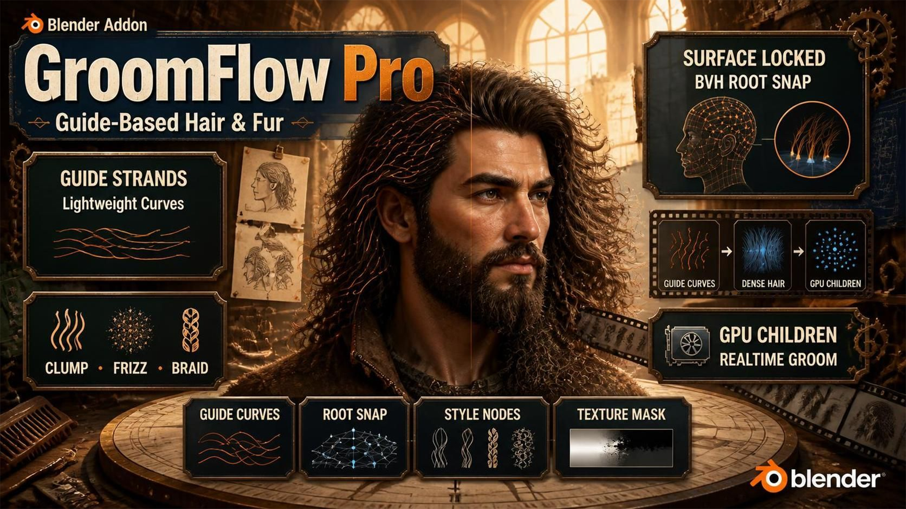
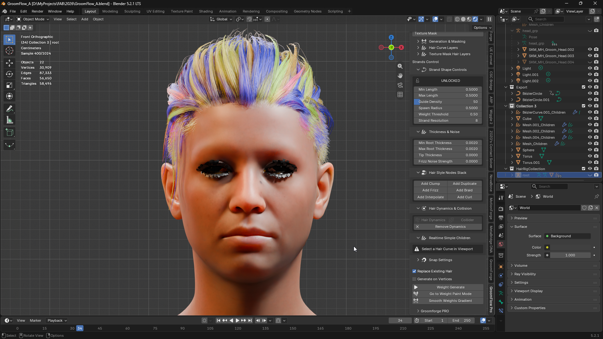
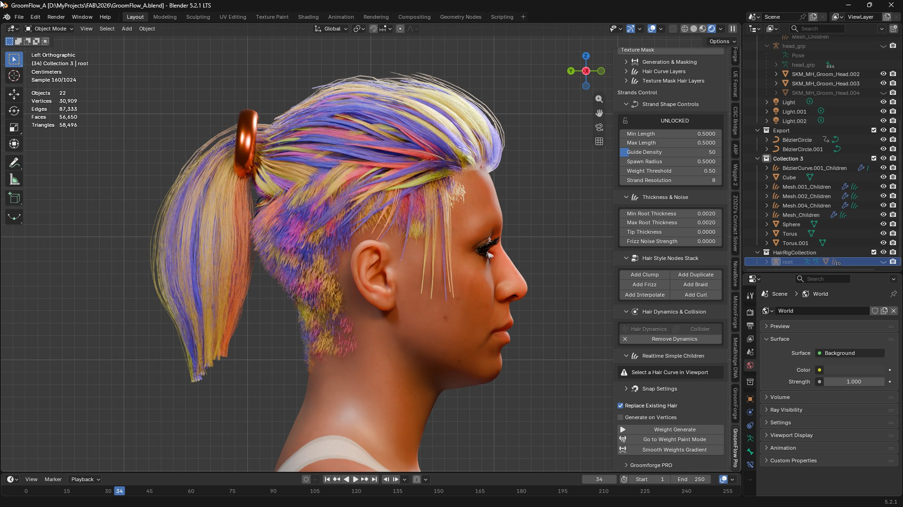
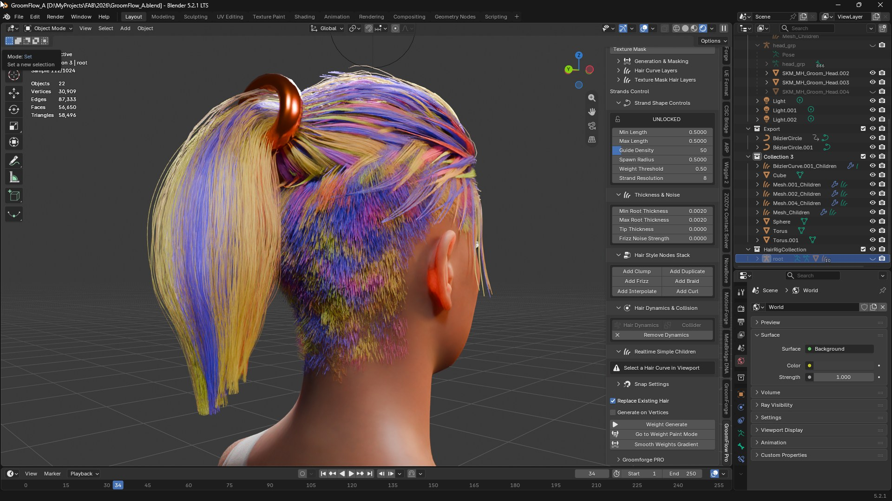
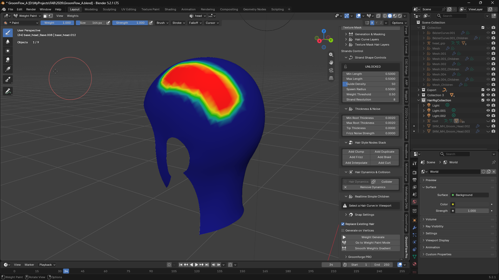
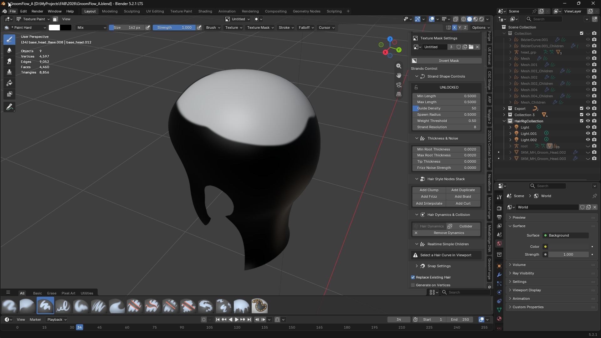

🇺🇸 English | [🇰🇷 한국어](./KO_index.md)

# 📖 GroomFlow Pro Add-on Guidebook

  <iframe width="640" height="360" src="https://www.youtube.com/embed/3SJY1sfO5JY" title="GroomFlow PRO v1.6.0 Guide New Update" frameborder="0" allow="accelerometer; autoplay; clipboard-write; encrypted-media; gyroscope; picture-in-picture; web-share" referrerpolicy="strict-origin-when-cross-origin" allowfullscreen></iframe>

* **Welcome to GroomFlow Pro**
  * Welcome to the official documentation and user guide for GroomFlow Pro.
  * Learn how to maximize your grooming workflow using this advanced guide-driven hair system.

---

## 🆕 What's New in v1.6.1

* **GPU-Accelerated Children — around 10x faster**
  * The realtime Children engine now runs its heavy math on your graphics card. Sculpting, combing and playing back simulation with children active are dramatically more responsive.
  * Measured on a typical groom: a live update that took **26 ms now takes 2.5 ms**. On a heavy groom of over a million child points, **270 ms drops to 27 ms**.
  * Nothing to switch on. GroomFlow checks your GPU when the groom is first built, and only uses it once it has confirmed the result matches. If your driver cannot handle it, the add-on quietly falls back to the CPU — the hair is always correct, never wrong-but-fast.
  * The Children panel shows which path is in use, so you can tell at a glance.
 
 
* **Hair Dynamics & Collision** *(Blender 5.2 or newer)*
  * One button attaches Blender's new XPBD hair solver to your guide curves, and another turns any mesh into a collider.
  * All solver settings — bendiness, damping, mass, surface collision, gravity — are laid out in the GroomFlow panel, so you never have to open the node editor to tune the simulation.
  * See **Section 9. Hair Dynamics & Collision**.
 
 
* **Clump ID — with a viewport preview**
  * Every strand now carries the ID of the clump it belongs to, written directly into the hair data at generation time.
  * Because GroomFlow knows exactly which guide each child grew from, the grouping is exact. Other tools have to guess it by clustering root positions, which splits real clumps apart and merges unrelated ones.
  * **Clump Size** merges neighbouring guides into bigger tufts, and **Clump Seed** reshuffles the arrangement without touching your combing.
  * **Preview Clump IDs** colours every strand by its clump so you can actually see the grouping.
  * See **Section 10 → Clump ID**.
 
 
* **Automatic Units — no more scale guessing**
  * GroomFlow now reads the real scale off your character and converts the sliders for you. A length of 0.5 means the same physical size on a normal Blender character and on a centimetre-authored Unreal/MetaHuman rig.
  * This replaces the old **Target Base Scale** slider, which you had to discover and set by hand. See **Section 1. Units & Scale**.
 
 
* **Guides Inside Children — one object to export**
  * The guides can now ride along inside the children object, flagged so Unreal can tell them apart.
  * A groom used to be two separate objects, so exporting brought two grooms into Unreal with the strands split between them. Now you export the children object alone and the whole groom arrives as one.
 
 
* **Fixes**
  * **Children no longer kink at the root.** Every child strand began one point up its guide instead of at the guide's own root, and the surface snap then pulled that point back down — leaving a small hook at the base of every strand. Raising Child Length past 1.0 hid it, which is why it looked like a length problem.
  * **Child Length above 1.0 really extends past the guide tip now.** It used to stack every point beyond the tip onto the tip itself, folding the end of the strand over.
  * **Clump Start now means what it says** — the point where clumping *begins*. It previously ramped the clump to full *before* that point, so a small value squeezed the whole change into the first segment or two.
  * **Texture Mask spreads evenly.** Roots bunched into one region and only filled in as you raised the guide count, because the mask was applied *after* allocating samples rather than before — black areas were handed samples and then threw them away. Coverage no longer depends on the count.
  * **Texture Mask is much faster on dense meshes** — measured on a 65,000-triangle head, 221 ms down to 87 ms.
  * **Generating a second groom no longer resets the first one.** Adding a new weight group and pressing Generate used to rebuild the previous layer's curves in place — throwing away everything that had been sculpted or combed into them — and it did so using the *old* weight group, so the newly painted one appeared to do nothing. A Generate aimed at a different mask now creates its own layer and leaves finished grooms alone.
  * **Spread Along Guide** had no effect at all. It works now.
  * **Texture Mask → Mask Generate** could fail to complete. Fixed.
  * Root placement on quad or n-gon meshes was bound to the wrong spot, so hair drifted when the character deformed. Fixed.
  * Style node sliders (Clump, Frizz, Curl…) did nothing on Blender 5.2. Fixed.
  * **Add Snap** could not set its target object on Blender 5.2. Fixed.
  * Weight smoothing on a dense head mesh took tens of seconds — it is now near-instant.
  * Pressing a style node button no longer causes a multi-second freeze.
  * Removing a hair layer now asks first, since it deletes the curves object.
  * Minimum supported Blender is now **4.5 LTS**. Verified on 4.5 LTS, 5.0, 5.2 LTS and 5.3.
---

## 🚀 Key Features Guide

* **Guide-Based Strand Generation**
  * Creates dense hair strands from a lightweight guide curve workflow without the performance limitations of traditional systems.
  * Built around a guide-to-strand generation pipeline, allowing artists to design clean guide curves while automatically generating large amounts of production-ready strands.

 
 
* **Surface-Locked Strand Distribution**
  * Fixes the issue where traditional duplication setups cause strands to float above the surface or clip through the mesh, especially around eyebrows, beards, eyelashes, and high-curvature facial areas.
  * Uses a BVHTree-powered surface projection system that snaps generated strand roots directly onto the target mesh.
  * Every generated strand remains accurately attached to the skin without floating roots, gaps, or penetration issues.

 
 
* **Optimized Production Workflow**
   
  * Keeps guide curves completely separated from generated output strands, providing a clean and non-destructive grooming workflow.
  * Mirrors modern professional grooming pipelines while maintaining a simple Blender-native workflow for character hair, eyebrows, facial hair, fur, and Unreal Engine groom preparation.
  * Designed to maximize visual fidelity while reducing manual cleanup and correction work during production.

---

## 🛠 Installation Guide

Before starting the workflow, make sure to set up the add-on correctly by following these steps:

1. **Download**
   * Get the latest version of the GroomFlow_Pro add-on file ready.
 
 
2. **Installation**
   * Install and activate the program within Blender preferences.
   * Follow the general Blender add-on installation guide.
 
 
3. **Install Essential Extensions**
   * Go to the Extensions menu inside the add-on preferences.
   * Click 'Install' on the recommended base extensions to unlock full functionality.
 
 
4. **Preferences**
   * Adjust the options to fit your specific workspace layout.

---

## 1. Units & Scale

Every length in GroomFlow — strand length, thickness, child radius — is measured in metres, and the add-on converts them to whatever scale your character is actually built at. **This is automatic; there is nothing to set for a normal groom.**

* **Why it matters**
  * A character exported from Unreal is authored in centimetres and then scaled down by the rig, so one metre is 100 units in its local space. A strand length of `0.5` on such a character used to come out a hundred times too short, and the hair collapsed into a speck at the scalp.
  * GroomFlow reads the true scale off the character itself, so the same slider value gives the same real-world size on any rig.
 
 
* **Units** *(in the Realtime Simple Children panel)*
  * **Auto Detect** — the default. Reads the scale from the Target Mesh. Leave it here unless you have a reason not to.
  * **Manual** — type the factor yourself. Use this when your mesh has a deliberate non-uniform scale that is part of the look rather than a unit mismatch, and you do not want it corrected.
  * A line under the setting reports what was detected, for example `1:1 (metres)` or `100x (Unreal / MetaHuman, cm)`.

> Upgrading from v1.5? The old **Target Base Scale** slider is gone — this replaces it and needs no input. If you had set it to something other than `1.0` to compensate for a scaled character, that compensation is now handled for you.

---

## 2. Masking Method

Before generating hair, select which masking mode to use. The two modes are completely independent and each maintains its own separate layer list.

* **Vertex Weight**
  * Uses a vertex group painted on the mesh to control where and how long hair grows.
  * Paint red areas for full-length hair and blue areas for shorter hair or no hair.
  * Best for organic shapes like scalp hair, eyebrows, and beard regions.

 
 
* **Texture Mask**
  * Uses a painted image texture to define the hair growth area and density.
  * Each layer has its own texture image, allowing multiple distinct hair regions to be managed independently.
  * Best for precise, UV-based control over hair placement — for example, fur patterns or stylized hair zones.

---

## 3. Generation & Masking Panel

This collapsible panel contains the vertex group list when using Vertex Weight mode.

* When a **mesh** is selected, the vertex group list for that mesh is displayed.
* Use **Add / Remove** buttons to create or delete vertex weight groups.
* The **Lock** button at the top of the list prevents accidental weight changes.
* In **Texture Mask** mode, a note directs you to the Texture Mask Hair Layers section below.

---

## 4. Hair Curve Layers

The Hair Curve Layers panel manages the list of generated hair objects in **Vertex Weight** mode.

* Each entry in the list represents one generated hair curve object linked to a vertex group mask.
* Use the **Up / Down** arrows to reorder layers in the stack.
* Use **Add** to create a new empty slot, or **Remove** to delete the selected layer entry.
* Clicking a layer in the list automatically activates the corresponding hair curve in the viewport.

---

## 5. Texture Mask Hair Layers

This panel manages hair layers generated using **Texture Mask** mode. It works independently from the Vertex Weight layer list.

* Each entry represents one hair curve object driven by a specific texture image.
* **Add** creates a new empty texture layer slot. The slot becomes active and ready to receive a generated hair object.
* **Remove** deletes the selected texture layer slot.
* **Texture Mask Settings** — shows the image picker for the currently active texture layer. Assign or create the mask image here before generating.
* **Invert Mask** — inverts the brightness values of the active mask image, flipping which areas grow hair.

### Texture Mask Workflow (Step by Step)

1. Switch Masking Method to **Texture Mask**.
2. Open the **Texture Mask Hair Layers** panel.
3. Press **Add** to create a new layer slot.
4. In the **Texture Mask Settings** area, assign or create a mask image for this layer.
5. Press **Go to Texture Paint Mode** to paint the mask directly on the mesh.
6. Return to Object Mode and press **Mask Generate** to create the hair curves.
7. Repeat from step 3 to build additional independently-masked hair layers.

> Each layer must have its own image assigned before generating. Generating without an image will use any existing untitled image or report a warning.

---

## 6. Strand Shape Controls

These settings control the shape and distribution of generated hair strands. Changing any value while a hair curve layer is active will automatically regenerate that layer in real time.

* **Lock / Unlock**
  * Locks the strand controls to prevent accidental changes after a groom is finalized.
  * Always lock before sculpting to protect your work from being overwritten by parameter changes.
 
 
* **Min Length**
  * Sets the minimum length for hair grown in low-weight areas.
  * Raising this value means even sparse areas produce longer strands.
 
 
* **Max Length**
  * Sets the maximum length for hair grown in fully-weighted (red) areas.
  * This is the primary length control for the densest regions of the groom.
 
 
* **Guide Density**
  * Controls the total number of hair guide curves generated on the surface.
  * Higher numbers produce denser coverage. Start lower while designing and increase for final output.
 
 
* **Spawn Radius**
  * Controls how far each generated hair root can randomly offset from the mesh surface sample point.
  * At 0.0, roots snap precisely to the surface. Increasing the value spreads roots into a wider area.
 
 
* **Weight Threshold**
  * Sets the minimum weight value required for a point on the mesh to spawn hair.
  * Raising this cuts off hair in lighter-weight zones. Lowering it below 0.01 ignores weights and spawns uniformly.
 
 
* **Strand Resolution**
  * Specifies the number of control points making up a single hair strand.
  * Higher values produce smoother, more flexible curves but increase memory and viewport load.

!!! warning
    * **Never Modify Properties After Manually Sculpting Curves**
      * Changing any Strand Shape value forces a complete regeneration of the hair, overwriting all sculpt edits.
      * Always use the **Lock** button before entering Sculpt Mode to prevent accidental overwrites.

---

## 7. Thickness & Noise Settings

* **Min Root Thickness**
  * Sets the minimum thickness for the root area of generated strands, applied in low-weight zones.
 
 
* **Max Root Thickness**
  * Sets the maximum thickness for the root area of generated strands, applied in high-weight zones.
 
 
* **Tip Thickness**
  * Controls the thickness at the very tip of each strand. Set near 0.0 for a natural tapered look.
 
 
* **Frizz Noise Strength**
  * Adds random directional noise to each strand, creating a naturally messy or frizzy appearance.
  * Higher values produce more chaotic, irregular silhouettes.

---

## 8. Hair Style Nodes Stack

Attach Blender geometry node modifiers to the active hair curve to shape the final look. Each button loads the corresponding node group from Blender's built-in Hair Essentials library.

* **Add Clump**
  * Pulls groups of strands together toward common cluster points, creating natural hair clumping.
 
 
* **Add Frizz**
  * Adds high-frequency noise breakup to individual strands for a naturally rough or frizzy texture.
 
 
* **Add Interpolate**
  * Fills in additional strands between existing guides, dramatically increasing visible density.
 
 
* **Add Duplicate**
  * Scatters offset copies of each strand to build up volume quickly without adding new guides.
 
 
* **Add Braid**
  * Weaves strands into a braided rope pattern for stylized braid or twist effects.
 
 
* **Add Curl**
  * Applies a helical curl deformation along the length of each strand for curly or wavy hairstyles.

---

## 9. Hair Dynamics & Collision

> Requires **Blender 5.2 or newer**. On older versions the panel says so and the buttons stay inactive.

Blender 5.2 introduced a new XPBD physics solver for hair. This panel wires it up for you and puts its settings where you can reach them — otherwise every adjustment means opening the node editor and digging inside a node group.

### Buttons

* **Hair Dynamics**
  * Select a guide curve and press this. The solver is attached and set to collide with the mesh the hair is attached to.
  * Press **Play** on the timeline to see it simulate.
 
 
* **Collider**
  * Select any mesh the hair should bump into — the body, a shoulder, a hat — and press this.
  * The scalp itself does not need a collider; that is already handled by **Surface Collision** below.
 
 
* **Remove Dynamics**
  * Strips the dynamics and collider setup back off the selected objects.

### Settings

These appear once Hair Dynamics has been added, and update the simulation as you change them.

* **Physics**
  * On, the solver simulates. Turn it off and the hair simply follows the animation without simulating.
 
 
* **Solver** — *Substeps*, *Constraint Steps*
  * Raise these if the hair passes through the body or stretches under fast motion. Higher values cost more to compute.
 
 
* **Structure**
  * **Bendiness** — how freely the strand bends. Low is stiff hair, high is soft.
  * **Root Bendiness** — how much it may bend right where it meets the scalp.
  * **Stretchiness** — how much the strand may lengthen. Keep near zero for hair.
  * **Mass**, **Friction** — weight and how much the strands drag on each other.
  * **Linear Damping** — raise it if the hair jitters.
  * **Angular Damping** — raise it if the hair whips around too freely.
 
 
* **Collision**
  * **Surface Collision** — keeps the hair off the mesh it grows from.
  * **Deforming Surface** — tick this when that mesh is rigged or animated.
  * **Surface Friction** — how much the hair slides across it.
  * **Gravity** — the hair falls. Turn it off for stylized or zero-gravity looks.

### Recommended Workflow

1. Shape your guide curves first. Dynamics simulates whatever shape you give it.
2. Select the guide curve → **Hair Dynamics**.
3. Select the body mesh → **Collider**.
4. Play the timeline and watch. If hair passes through the body, raise **Substeps**; if it jitters, raise **Linear Damping**.
5. Leave **Live OFF** while previewing — the children follow the simulated guides on their own (see Passive Follow in the next section).

---

## 10. Realtime Simple Children

The Children system generates a cloud of short, naturally distributed child strands around each guide curve. Children stay synchronized with the guide in two complementary ways — a lightweight always-on follow, and an optional precise live recompute — so you get real-time feedback without paying the full performance cost all the time.

As of v1.6.0 the live recompute runs on your graphics card, roughly ten times faster than before. A status line at the top of the panel tells you which path is active:

* `GPU: OPENGL / <your graphics card>` — the fast path is running.
* `GPU: unavailable - using CPU` — GroomFlow checked your GPU, the result did not match, and it switched to the CPU. The groom is still correct, just slower.

To use this panel, select a **hair curve object** in the viewport. The panel will display the active layer name and its settings.

### Setup

* **Active Layer**
  * Displays the name of the currently selected guide curve receiving children.
 
 
* **Target Mesh**
  * Select the body or scalp mesh that this guide curve is attached to.
  * Use the eyedropper to pick the mesh directly from the viewport.
  * This must be set before building children.

### Buttons

* **Build Children**
  * Generates or regenerates children for the currently active guide curve.
  * Creates a `{CurveName}_Children` object in the scene containing all child strands, already surface-bound to the Target Mesh.
  * Also attaches a lightweight follow modifier that keeps children glued to whatever the guide is currently doing — see **Passive Follow** below.
  * Press this once per guide curve. Press again to rebuild if Child Count, Radius, Clump, or Root Distribution settings change.
  * Each guide curve has its own independent children object.
 
 
* **Live OFF / Live ON** (toggle)
  * Toggles the precise real-time recompute engine used while actively sculpting or combing.
  * **Live ON** — clump, twist, and root-scatter are fully recalculated every time the guide changes. Use this while you are actively shaping the groom with sculpt tools.
  * **Live OFF** — the recompute engine stops running. Children are not frozen, though — see below.
  * The Live Engine is shared across all guide curves. Turn it on while grooming, off when you're done shaping and just want to preview motion or simulation.

### Passive Follow — children keep moving even with Live OFF

Every time **Build Children** runs, a small geometry-node modifier (`GF_ChildrenGuideFollow`) is attached to the children object. It reads the guide's current position directly from Blender's own dependency graph and offsets the children to match — no Python code runs for this, so it costs virtually nothing.

This means: if you turn on Blender's native **Hair Dynamics** simulation on the guide curve, or simply play back an animation that poses the character, the children will follow along even with Live OFF. This is the intended way to preview simulation or animation — leave Live OFF, let Passive Follow carry the motion, and only switch Live ON again when you want to re-shape the clump/twist detail by hand.

> Passive Follow moves each child strand rigidly along with its guide's root — it does not re-run the clump/twist math. For that, use Live ON.

### Recommended Workflow for Multiple Guide Curves

1. Select guide curve 1 → set Target Mesh → press **Build Children**.
2. Select guide curve 2 → set Target Mesh → press **Build Children**.
3. Continue for all guide curves.
4. While actively shaping the groom, press **Live ON** — clump/twist recompute live as you sculpt.
5. When you're done shaping, press **Live OFF**. Children stay put, and Passive Follow keeps them attached if the guide is later simulated or animated.

> **Important:** Build Children and Live Engine are separate actions. You can build children for all curves first, then enable Live once. You do not need to turn the engine on and off between each curve.

   

### Child Strand Settings

* **Child Count**
  * Number of child strands generated per guide curve.
  * Higher values produce denser hair volume. Balance against viewport performance.
 
 
* **Child Point Resolution**
  * Number of control points per child strand. Higher values make smoother curves.
 
 
* **Units**
  * How the lengths below are converted to your character's scale. Leave on **Auto Detect** — see **Section 1. Units & Scale**.
 
 
* **Guides Inside Children**
  * On by default. The guide curves are carried inside the children object as well, marked so Unreal can tell which strands are guides.
  * This is what lets you export the children object on its own and have the complete groom — guides included — arrive in Unreal as a single asset. With it off, the guides and children stay two separate objects and a groom has to be exported twice.
 
 
* **Radius**
  * The spread radius around the guide root where child roots are distributed.
  * Small values keep children tightly grouped; large values spread them wide.
 
 
* **Length Min**
  * Minimum length ratio of child strands relative to the parent guide. Values below 1.0 create naturally varied shorter hairs.
 
 
* **Length Max**
  * Maximum length ratio relative to the parent guide. Values above 1.0 allow some children to extend beyond the guide tip.

### Clump Settings

Controls how child strands pull toward the guide curve's tip, forming natural hair clumps.

* **Clump** — overall strength of the clumping pull toward the guide tip.
* **Clump Start** — the point along the strand where clumping begins (0 = root, 1 = tip). Below this the children stay fully spread.
* **Clump Shape** — how the clumping eases in between Clump Start and the tip. Low values pull the strands together early; high values hold them apart and close near the tip.
* **Clump Noise** — adds random per-strand variation to break up uniform clumping patterns.
* **Clump Twist** — rotates child strands around the guide axis as they clump, creating a spiral wrap effect. Negative values twist the other way.
* **Clump Offset** — shifts the point the strands converge on away from the guide tip.

> **Changed in v1.6.0:** Clump Start used to reach *full* clumping by the point it names, rather than starting there — which squeezed the whole transition into the first segment or two and left a visible hook at the root. It now behaves as described above. Grooms saved with a Clump Start above 0 will look a little looser than before; raise **Clump** slightly to match.

### Root Distribution Settings

Controls where child strand roots are placed relative to the guide root.

* **Root Spread** — radius of the disk area around the guide root where children are scattered. At 0.0, all children start exactly at the guide root.
* **Spread Along Guide** — when Root Spread is greater than 0, this stretches the scatter along the direction the guide lies in, instead of an even circle. Use it for hair that is combed flat against the scalp.
* **Root Seed** — random seed for the child root placement pattern. Change this to get a different arrangement without changing any other settings.

> **Fixed in v1.6.0:** *Spread Along Guide* previously had no effect no matter what it was set to. It now works as described.

### Clump ID

Every strand carries the ID of the clump it belongs to, stored in the hair data itself as `clumpid`. Unreal and other groom tools read this to keep a tuft of hair together when shading and simulating.

GroomFlow knows exactly which guide each child grew from, so its clump grouping is exact. Tools without that relationship have to guess it by clustering root positions, which splits real tufts apart and merges unrelated ones.

* **Clump Size**
  * How many neighbouring guides share a single clump.
  * At `1` — the default — every guide is its own clump. Raise it to merge nearby guides into larger, chunkier tufts.
  * Guides are grouped by where they actually sit on the head, not by the order they were created, so a clump is always a real physical tuft.
 
 
* **Clump Seed**
  * Reshuffles which guides fall into which clump. The number of clumps stays the same.
  * **This does not regenerate your groom.** Combing, sculpting and every strand position are left exactly as they are — only the grouping changes — so you can keep trying arrangements on a finished groom.
 
 
* **Preview Clump IDs** *(toggle)*
  * Colours every strand by the clump it belongs to and switches the viewport to Material Preview so you can see it.
  * Press it again to turn it off. The preview colour, its material and your viewport shading are all put back the way they were; the clump data itself is untouched.

---

## 11. Generation Options

* **Replace Existing Hair**
  * When enabled, generating hair overwrites the curves in the currently active layer.
  * When disabled, each generation creates an entirely new layer on top of existing ones.
  * Leave this enabled during normal grooming to avoid accumulating redundant objects.

 
 
* **Generate on Vertices**
  * Snaps and generates hair guide curve roots precisely onto mesh vertices instead of face surfaces.
  * Useful for low-poly assets or grooms that require roots to align exactly with the mesh topology.

---

## 12. Process Control Buttons

### Vertex Weight Mode

* **Weight Generate**
  * Runs the hair generation algorithm using the active vertex weight group as the mask.
  * Generates hair strands directly onto the mesh surface based on painted weight values.
  * Red areas produce full-length hair; lower-weight areas produce shorter or no hair.
 
 
* **Go to Weight Paint Mode**
  * Switches the active mesh into Weight Paint Mode for direct vertex weight editing.
  * Paint red (weight 1.0) for dense, full-length hair and blue (weight 0.0) to suppress hair.
 
 
* **Smooth Weights Gradient**
  * Softens sharp transitions in the active weight map into a smooth gradient.
  * Prevents abrupt length changes at the boundary between painted and unpainted areas.

### Texture Mask Mode

* **Mask Generate**
  * Generates hair using the active texture layer's image as the mask.
  * Bright (white) areas in the image produce hair; dark (black) areas suppress it.
 
 
* **Go to Texture Paint Mode**
  * Switches the active mesh into Texture Paint Mode with the active mask image pre-selected.
  * Paint white to add hair and black to remove it.

---

## 13. Snap Settings

* **Add Snap**
  * Applies a Geometry Nodes-based precision snap system to the active hair curve.
  * Keeps hair roots locked to the mesh surface, preventing floating or clipping even when the mesh deforms (shape keys, simulations, etc.).
  * Requires a hair curve to be selected. The Target Mesh must be set in the Children panel first.

---

## 14. Unreal Engine Pipeline & Expert Synergy Workflow

Finalize your asset data blocks and prepare your grooms for cinematic export integration.
 
 
* **Scale — now handled for you**
  * Blender and Unreal describe world scale differently, which is why imported hair so often arrives as giant sheets or microscopic pins.
  * As of v1.6.0 there is nothing to calibrate. GroomFlow reads the real scale off your character and builds the groom at the correct size on both a metre-based Blender character and a centimetre-authored Unreal/MetaHuman rig. See **Section 1. Units & Scale**.
  * If a character has a deliberate non-uniform scale you want preserved, switch **Units** to **Manual** and enter the factor yourself.
 
 
* **Export the children object alone**
  * Leave **Guides Inside Children** on. The guides travel inside the children object, flagged as guides, so Unreal receives one complete groom instead of two half ones.
  * The strands also carry **Clump ID** and their guide assignment, so Unreal's clump-based shading and simulation have the grouping GroomFlow actually used rather than a re-guessed approximation.
 
 
* **Professional GroomForge Pro Synergy**
  * Exporting hair meshes can be tricky due to world matrix mismatches across different software spaces.
  * `Seamless Matrix Synchronization`:
    * When paired with the **GroomForge Pro** add-on, your separated guide and child strand layers bypass all transformation conversion issues entirely.
    * Ensures a 100% flawless, automated import layout into Unreal Engine's native Groom asset system without manual repositioning.
 
 
* **Performance Tip (Resolution Management)**
  * Optimize your setup dynamically to maintain professional-grade viewport reactivity while working on dense hair grooms.
  * `Real-time Efficiency`:
    * Lower the Strand Resolution down to `4` or `6` while designing massive hairstyles to maximize your viewport FPS smoothness.
    * Simply bump it back up to `12` right before rendering final frames in Cycles or executing your absolute groom exports to Unreal Engine.
