# 📖 GroomFlow Pro Add-on Guidebook

* **Welcome to GroomFlow Pro**
  * Welcome to the official documentation and user guide for GroomFlow Pro.
  * Learn how to maximize your grooming workflow using this advanced guide-driven hair system.
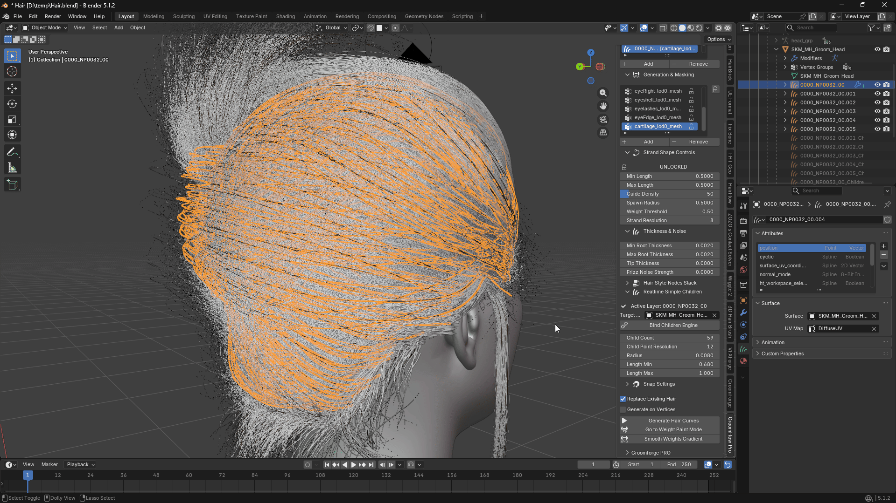
---

## 🆕 What's New in v1.5.0

* **Faster Children — noticeably lighter on the viewport**
  * The realtime Children engine got a substantial performance pass this release. Sculpting, combing, and simulating with children active should all feel noticeably lighter, especially with high Child Count or many guide curves.
  * These are internal engine improvements — no settings changed, no new steps required. Just Build Children as usual and enjoy the improved responsiveness.
 
 
* **Live Engine — Passive Follow while Live is OFF**
  * The single biggest change this release: children now keep following the guide curve even when the **Live** toggle is switched OFF.
  * Turn on Blender's native Hair Dynamics on a guide curve, or play back an animated character, and the children will move along with it — without the Live Engine needing to run in the background.
  * This means **Live ON** is now reserved for the moments you're actively sculpting or combing and need full clump/twist detail recalculated in real time. Once you're done shaping, switch **Live OFF** — the groom won't freeze, it will keep following any simulation or animation applied to the guide, at essentially zero extra cost.
  * See **Section 9. Realtime Simple Children** below for the full breakdown of Build Children vs. Live ON vs. Passive Follow.
---

## 🚀 Key Features Guide

* **Guide-Based Strand Generation**
  * Creates dense hair strands from a lightweight guide curve workflow without the performance limitations of traditional systems.
  * Built around a guide-to-strand generation pipeline, allowing artists to design clean guide curves while automatically generating large amounts of production-ready strands.
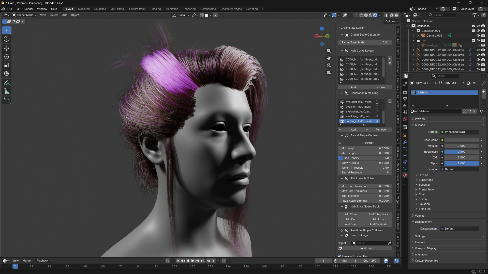
 
 
* **Surface-Locked Strand Distribution**
  * Fixes the issue where traditional duplication setups cause strands to float above the surface or clip through the mesh, especially around eyebrows, beards, eyelashes, and high-curvature facial areas.
  * Uses a BVHTree-powered surface projection system that snaps generated strand roots directly onto the target mesh.
  * Every generated strand remains accurately attached to the skin without floating roots, gaps, or penetration issues.
  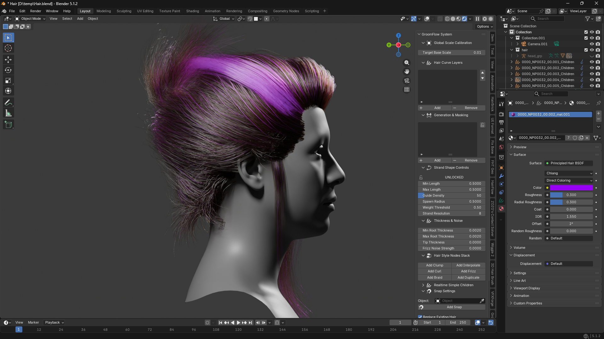
 
 
* **Optimized Production Workflow**
   
  * Keeps guide curves completely separated from generated output strands, providing a clean and non-destructive grooming workflow.
  * Mirrors modern professional grooming pipelines while maintaining a simple Blender-native workflow for character hair, eyebrows, facial hair, fur, and Unreal Engine groom preparation.
  * Designed to maximize visual fidelity while reducing manual cleanup and correction work during production.
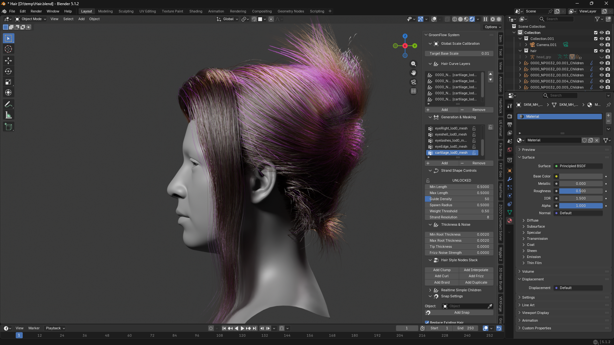
---

## 🛠 Installation Guide

Before starting the workflow, make sure to set up the add-on correctly by following these steps:

1. **Download**
   * Get the latest version of the GroomFlow_Pro add-on file ready.
 
 
2. **Installation**
   * Install and activate the program within Blender preferences.
   * Follow the general Blender add-on installation guide.
 
 
3. **Install Essential Extensions**
   * Go to the Extensions menu inside the add-on preferences.
   * Click 'Install' on the recommended base extensions to unlock full functionality.
 
 
4. **Preferences**
   * Adjust the options to fit your specific workspace layout.

---

## 1. Global Scale Calibration

* **Target Base Scale**
  * Sets the global base scale factor for all generated hair guide curves.
  * Prevents hair from appearing too small or large due to scene units or character mesh scale differences.
  * Adjust this value from the default 1.0 to uniformly control the scale of all guide curves.
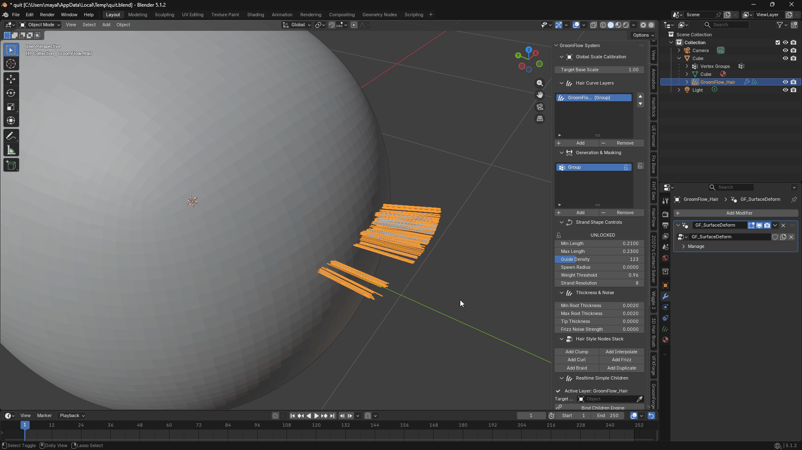

---

## 2. Masking Method

Before generating hair, select which masking mode to use. The two modes are completely independent and each maintains its own separate layer list.

* **Vertex Weight**
  * Uses a vertex group painted on the mesh to control where and how long hair grows.
  * Paint red areas for full-length hair and blue areas for shorter hair or no hair.
  * Best for organic shapes like scalp hair, eyebrows, and beard regions.
 
 
* **Texture Mask**
  * Uses a painted image texture to define the hair growth area and density.
  * Each layer has its own texture image, allowing multiple distinct hair regions to be managed independently.
  * Best for precise, UV-based control over hair placement — for example, fur patterns or stylized hair zones.

---

## 3. Generation & Masking Panel

This collapsible panel contains the vertex group list when using Vertex Weight mode.

* When a **mesh** is selected, the vertex group list for that mesh is displayed.
* Use **Add / Remove** buttons to create or delete vertex weight groups.
* The **Lock** button at the top of the list prevents accidental weight changes.
* In **Texture Mask** mode, a note directs you to the Texture Mask Hair Layers section below.

---

## 4. Hair Curve Layers

The Hair Curve Layers panel manages the list of generated hair objects in **Vertex Weight** mode.

* Each entry in the list represents one generated hair curve object linked to a vertex group mask.
* Use the **Up / Down** arrows to reorder layers in the stack.
* Use **Add** to create a new empty slot, or **Remove** to delete the selected layer entry.
* Clicking a layer in the list automatically activates the corresponding hair curve in the viewport.

---

## 5. Texture Mask Hair Layers

This panel manages hair layers generated using **Texture Mask** mode. It works independently from the Vertex Weight layer list.

* Each entry represents one hair curve object driven by a specific texture image.
* **Add** creates a new empty texture layer slot. The slot becomes active and ready to receive a generated hair object.
* **Remove** deletes the selected texture layer slot.
* **Texture Mask Settings** — shows the image picker for the currently active texture layer. Assign or create the mask image here before generating.
* **Invert Mask** — inverts the brightness values of the active mask image, flipping which areas grow hair.

### Texture Mask Workflow (Step by Step)

1. Switch Masking Method to **Texture Mask**.
2. Open the **Texture Mask Hair Layers** panel.
3. Press **Add** to create a new layer slot.
4. In the **Texture Mask Settings** area, assign or create a mask image for this layer.
5. Press **Go to Texture Paint Mode** to paint the mask directly on the mesh.
6. Return to Object Mode and press **Mask Generate** to create the hair curves.
7. Repeat from step 3 to build additional independently-masked hair layers.

> Each layer must have its own image assigned before generating. Generating without an image will use any existing untitled image or report a warning.

---

## 6. Strand Shape Controls

These settings control the shape and distribution of generated hair strands. Changing any value while a hair curve layer is active will automatically regenerate that layer in real time.

* **Lock / Unlock**
  * Locks the strand controls to prevent accidental changes after a groom is finalized.
  * Always lock before sculpting to protect your work from being overwritten by parameter changes.
 
 
* **Min Length**
  * Sets the minimum length for hair grown in low-weight areas.
  * Raising this value means even sparse areas produce longer strands.
 
 
* **Max Length**
  * Sets the maximum length for hair grown in fully-weighted (red) areas.
  * This is the primary length control for the densest regions of the groom.
 
 
* **Guide Density**
  * Controls the total number of hair guide curves generated on the surface.
  * Higher numbers produce denser coverage. Start lower while designing and increase for final output.
 
 
* **Spawn Radius**
  * Controls how far each generated hair root can randomly offset from the mesh surface sample point.
  * At 0.0, roots snap precisely to the surface. Increasing the value spreads roots into a wider area.
 
 
* **Weight Threshold**
  * Sets the minimum weight value required for a point on the mesh to spawn hair.
  * Raising this cuts off hair in lighter-weight zones. Lowering it below 0.01 ignores weights and spawns uniformly.
 
 
* **Strand Resolution**
  * Specifies the number of control points making up a single hair strand.
  * Higher values produce smoother, more flexible curves but increase memory and viewport load.
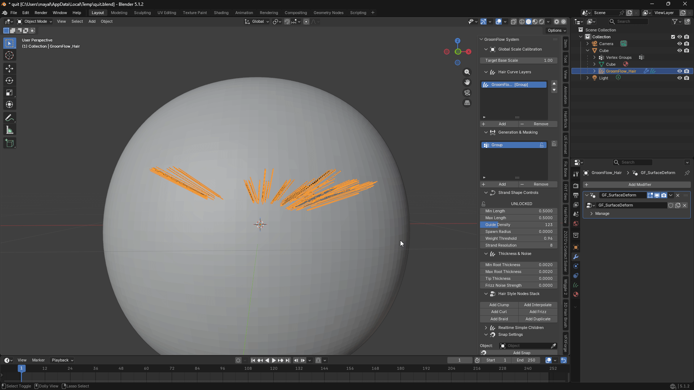

!!! warning
    * **Never Modify Properties After Manually Sculpting Curves**
      * Changing any Strand Shape value forces a complete regeneration of the hair, overwriting all sculpt edits.
      * Always use the **Lock** button before entering Sculpt Mode to prevent accidental overwrites.

---

## 7. Thickness & Noise Settings

* **Min Root Thickness**
  * Sets the minimum thickness for the root area of generated strands, applied in low-weight zones.
 
 
* **Max Root Thickness**
  * Sets the maximum thickness for the root area of generated strands, applied in high-weight zones.
 
 
* **Tip Thickness**
  * Controls the thickness at the very tip of each strand. Set near 0.0 for a natural tapered look.
 
 
* **Frizz Noise Strength**
  * Adds random directional noise to each strand, creating a naturally messy or frizzy appearance.
  * Higher values produce more chaotic, irregular silhouettes.
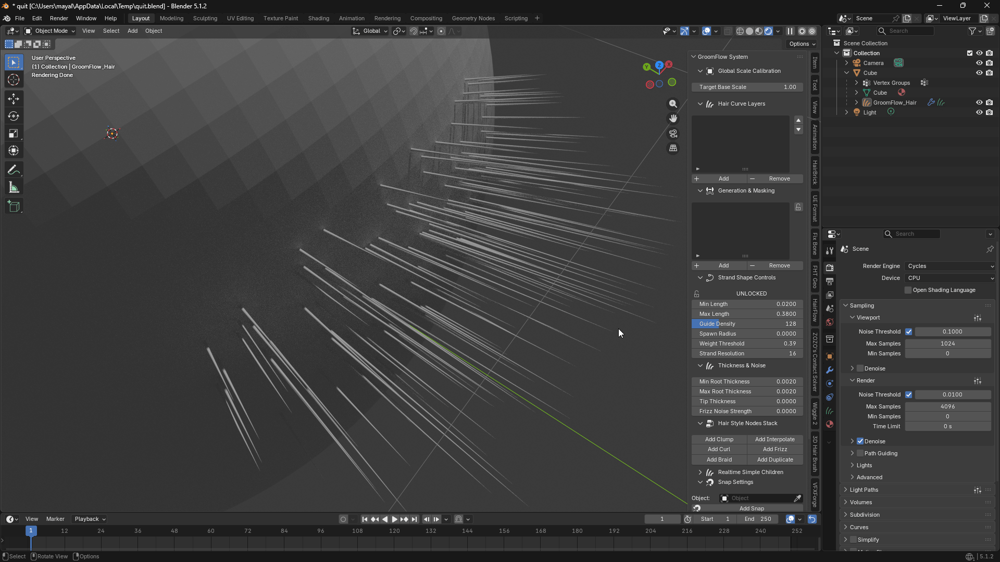

---

## 8. Hair Style Nodes Stack

Attach Blender geometry node modifiers to the active hair curve to shape the final look. Each button loads the corresponding node group from Blender's built-in Hair Essentials library.

* **Add Clump**
  * Pulls groups of strands together toward common cluster points, creating natural hair clumping.
 
 
* **Add Frizz**
  * Adds high-frequency noise breakup to individual strands for a naturally rough or frizzy texture.
 
 
* **Add Interpolate**
  * Fills in additional strands between existing guides, dramatically increasing visible density.
 
 
* **Add Duplicate**
  * Scatters offset copies of each strand to build up volume quickly without adding new guides.
 
 
* **Add Braid**
  * Weaves strands into a braided rope pattern for stylized braid or twist effects.
 
 
* **Add Curl**
  * Applies a helical curl deformation along the length of each strand for curly or wavy hairstyles.
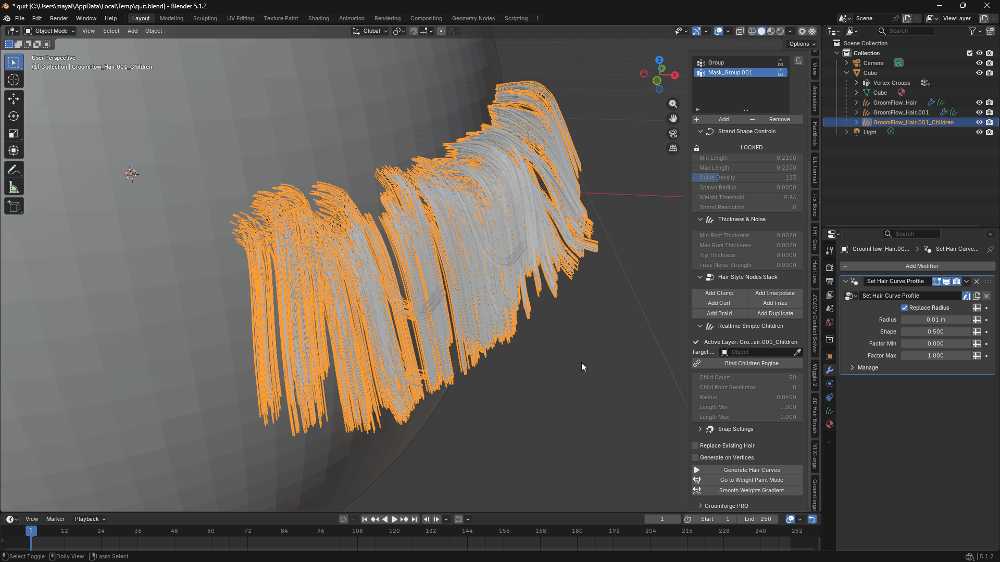

---

## 9. Realtime Simple Children

The Children system generates a cloud of short, naturally distributed child strands around each guide curve. As of v1.5.0, children stay synchronized with the guide in two complementary ways — a lightweight always-on follow, and an optional precise live recompute — so you get real-time feedback without paying the full performance cost all the time.

To use this panel, select a **hair curve object** in the viewport. The panel will display the active layer name and its settings.

### Setup

* **Active Layer**
  * Displays the name of the currently selected guide curve receiving children.
 
 
* **Target Mesh**
  * Select the body or scalp mesh that this guide curve is attached to.
  * Use the eyedropper to pick the mesh directly from the viewport.
  * This must be set before building children.

### Buttons

* **Build Children**
  * Generates or regenerates children for the currently active guide curve.
  * Creates a `{CurveName}_Children` object in the scene containing all child strands, already surface-bound to the Target Mesh.
  * Also attaches a lightweight follow modifier that keeps children glued to whatever the guide is currently doing — see **Passive Follow** below.
  * Press this once per guide curve. Press again to rebuild if Child Count, Radius, Clump, or Root Distribution settings change.
  * Each guide curve has its own independent children object.
 
 
* **Live OFF / Live ON** (toggle)
  * Toggles the precise real-time recompute engine used while actively sculpting or combing.
  * **Live ON** — clump, twist, and root-scatter are fully recalculated every time the guide changes. Use this while you are actively shaping the groom with sculpt tools.
  * **Live OFF** — the recompute engine stops running. Children are not frozen, though — see below.
  * The Live Engine is shared across all guide curves. Turn it on while grooming, off when you're done shaping and just want to preview motion or simulation.

### Passive Follow — children keep moving even with Live OFF

Every time **Build Children** runs, a small geometry-node modifier (`GF_ChildrenGuideFollow`) is attached to the children object. It reads the guide's current position directly from Blender's own dependency graph and offsets the children to match — no Python code runs for this, so it costs virtually nothing.

This means: if you turn on Blender's native **Hair Dynamics** simulation on the guide curve, or simply play back an animation that poses the character, the children will follow along even with Live OFF. This is the intended way to preview simulation or animation — leave Live OFF, let Passive Follow carry the motion, and only switch Live ON again when you want to re-shape the clump/twist detail by hand.

> Passive Follow moves each child strand rigidly along with its guide's root — it does not re-run the clump/twist math. For that, use Live ON.

### Recommended Workflow for Multiple Guide Curves

1. Select guide curve 1 → set Target Mesh → press **Build Children**.
2. Select guide curve 2 → set Target Mesh → press **Build Children**.
3. Continue for all guide curves.
4. While actively shaping the groom, press **Live ON** — clump/twist recompute live as you sculpt.
5. When you're done shaping, press **Live OFF**. Children stay put, and Passive Follow keeps them attached if the guide is later simulated or animated.

> **Important:** Build Children and Live Engine are separate actions. You can build children for all curves first, then enable Live once. You do not need to turn the engine on and off between each curve.

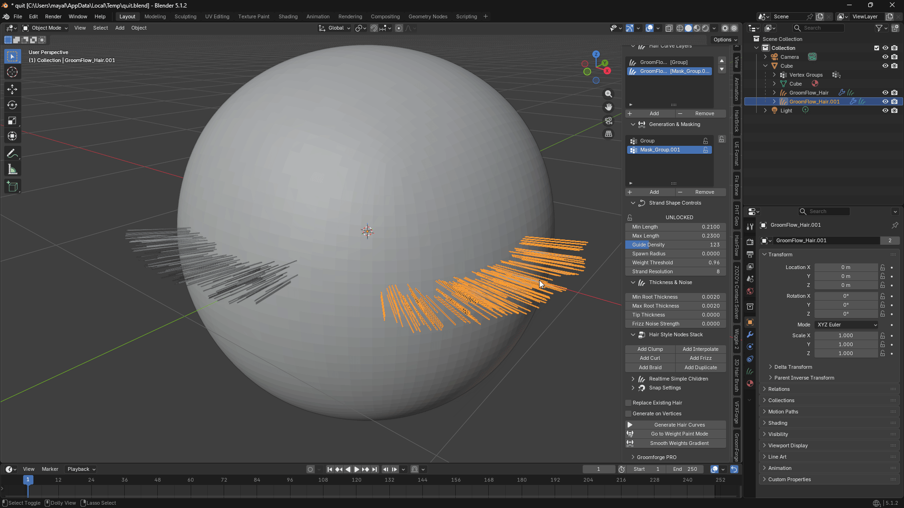
   
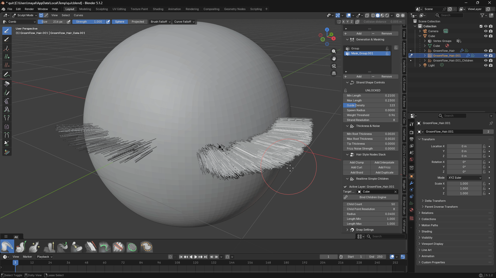

### Child Strand Settings

* **Child Count**
  * Number of child strands generated per guide curve.
  * Higher values produce denser hair volume. Balance against viewport performance.
 
 
* **Child Point Resolution**
  * Number of control points per child strand. Higher values make smoother curves.
 
 
* **Radius**
  * The spread radius around the guide root where child roots are distributed.
  * Small values keep children tightly grouped; large values spread them wide.
 
 
* **Length Min**
  * Minimum length ratio of child strands relative to the parent guide. Values below 1.0 create naturally varied shorter hairs.
 
 
* **Length Max**
  * Maximum length ratio relative to the parent guide. Values above 1.0 allow some children to extend beyond the guide tip.

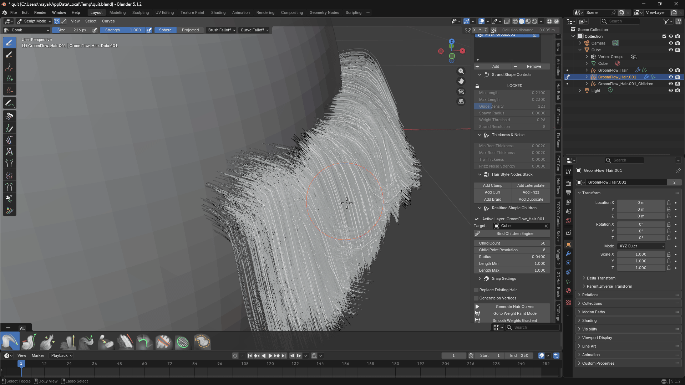

### Clump Settings

Controls how child strands pull toward the guide curve's tip, forming natural hair clumps.

* **Clump** — overall strength of the clumping pull toward the guide tip.
* **Clump Start** — point along the strand where clumping begins (0 = root, 1 = tip).
* **Clump Shape** — curve shape of the clumping falloff. Positive values flare at the base; negative values tighten toward the tip.
* **Clump Noise** — adds random per-strand variation to break up uniform clumping patterns.
* **Clump Twist** — rotates child strands around the guide axis as they clump, creating a spiral wrap effect.
* **Clump Offset** — offsets the clumping anchor point along the guide for fine-tuned control.

### Root Distribution Settings

Controls where child strand roots are placed relative to the guide root.

* **Root Spread** — radius of the disk area around the guide root where children are scattered. At 0.0, all children start exactly at the guide root.
* **Spread Along Guide** — when Root Spread is greater than 0, this blends the distribution between a flat disk (0.0) and a spread that follows the guide direction (1.0).
* **Root Seed** — random seed for the child root placement pattern. Change this to get a different arrangement without changing any other settings.

---

## 10. Generation Options

* **Replace Existing Hair**
  * When enabled, generating hair overwrites the curves in the currently active layer.
  * When disabled, each generation creates an entirely new layer on top of existing ones.
  * Leave this enabled during normal grooming to avoid accumulating redundant objects.

 
 
* **Generate on Vertices**
  * Snaps and generates hair guide curve roots precisely onto mesh vertices instead of face surfaces.
  * Useful for low-poly assets or grooms that require roots to align exactly with the mesh topology.
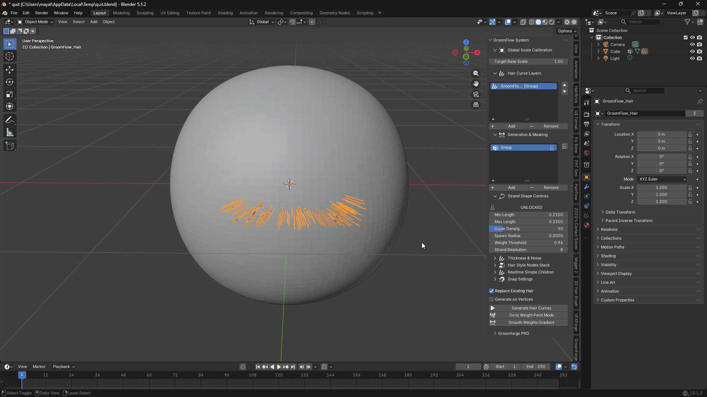

---

## 11. Process Control Buttons

### Vertex Weight Mode

* **Weight Generate**
  * Runs the hair generation algorithm using the active vertex weight group as the mask.
  * Generates hair strands directly onto the mesh surface based on painted weight values.
  * Red areas produce full-length hair; lower-weight areas produce shorter or no hair.
 
 
* **Go to Weight Paint Mode**
  * Switches the active mesh into Weight Paint Mode for direct vertex weight editing.
  * Paint red (weight 1.0) for dense, full-length hair and blue (weight 0.0) to suppress hair.
 
 
* **Smooth Weights Gradient**
  * Softens sharp transitions in the active weight map into a smooth gradient.
  * Prevents abrupt length changes at the boundary between painted and unpainted areas.

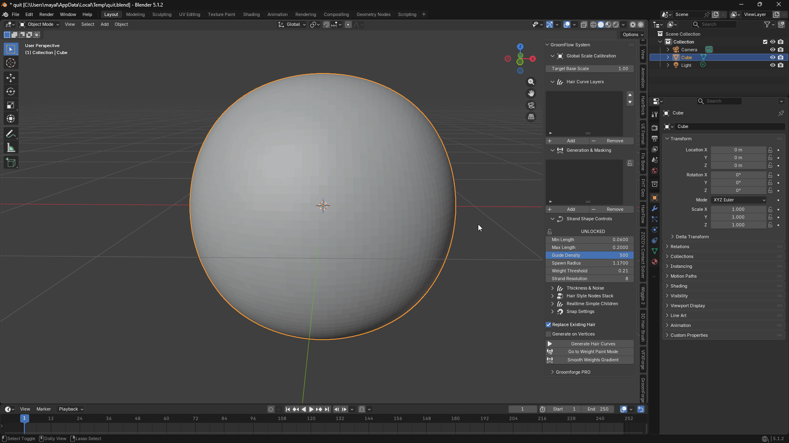
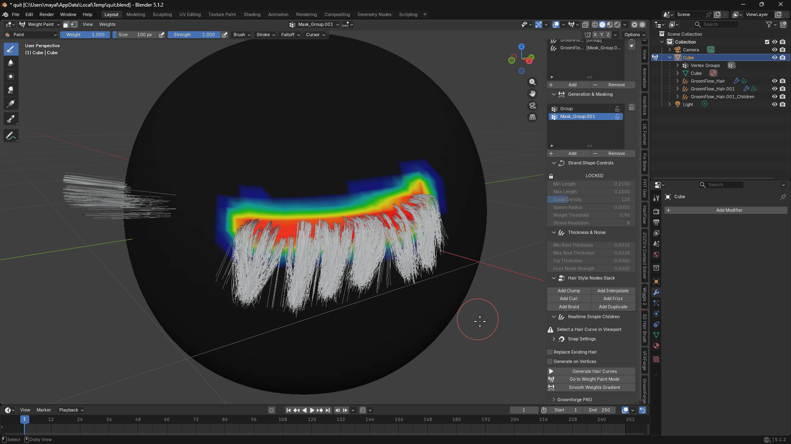

### Texture Mask Mode

* **Mask Generate**
  * Generates hair using the active texture layer's image as the mask.
  * Bright (white) areas in the image produce hair; dark (black) areas suppress it.
 
 
* **Go to Texture Paint Mode**
  * Switches the active mesh into Texture Paint Mode with the active mask image pre-selected.
  * Paint white to add hair and black to remove it.

---

## 12. Snap Settings

* **Add Snap**
  * Applies a Geometry Nodes-based precision snap system to the active hair curve.
  * Keeps hair roots locked to the mesh surface, preventing floating or clipping even when the mesh deforms (shape keys, simulations, etc.).
  * Requires a hair curve to be selected. The Target Mesh must be set in the Children panel first.

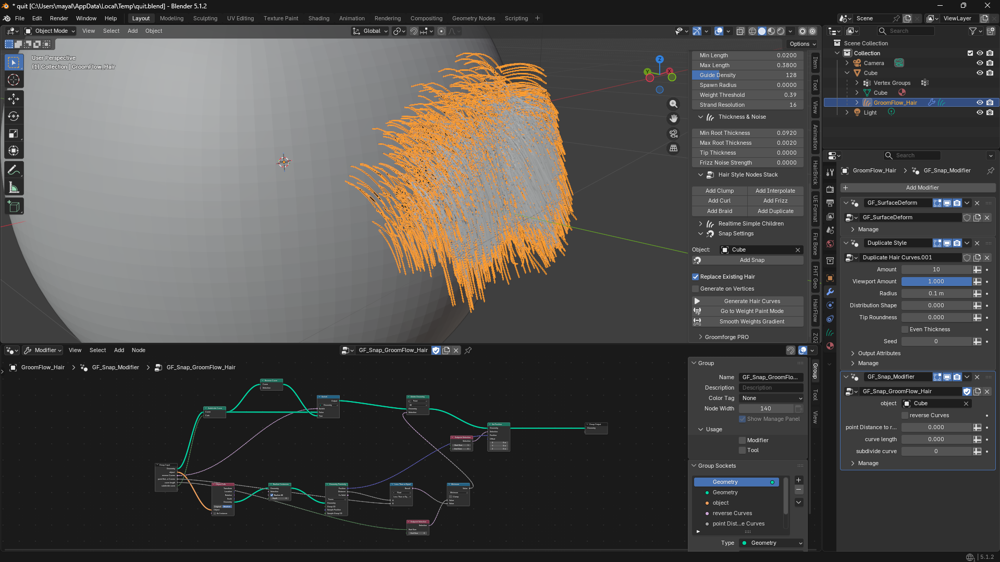

---

## 13. Unreal Engine Pipeline & Expert Synergy Workflow

Finalize your asset data blocks and prepare your grooms for cinematic export integration.
 
 
* **Global Scale Calibration (The Target Base Scale Control)**
  * Blender and Unreal Engine handle FBX/Groom world scale matrices completely differently.
  * Often causes imported hairstyles to explode into giant sheets or shrink into microscopic pins upon export.
  * `Procedural Pre-Baking Calibration`:
    * Instead of unreliably changing the raw Blender Unit or risking matrix artifacts during asset export, adjust the **Target Base Scale** slider to calibrate your groom dynamically.
  * `Flawless Pipeline Target`:
    * Keep it at `1.00` for standard Blender rendering setups.
    * Set it precisely to your target engine scaling coefficient before running ultimate simulation exports.
    * Enforces an absolute transformation sync into Unreal Engine 5.7+ New Dataflow system without altering the core mesh scales.
 
 
* **Professional GroomForge Pro Synergy**
  * Exporting hair meshes can be tricky due to world matrix mismatches across different software spaces.
  * `Seamless Matrix Synchronization`:
    * When paired with the **GroomForge Pro** add-on, your separated guide and child strand layers bypass all transformation conversion issues entirely.
    * Ensures a 100% flawless, automated import layout into Unreal Engine's native Groom asset system without manual repositioning.
 
 
* **Performance Tip (Resolution Management)**
  * Optimize your setup dynamically to maintain professional-grade viewport reactivity while working on dense hair grooms.
  * `Real-time Efficiency`:
    * Lower the Strand Resolution down to `4` or `6` while designing massive hairstyles to maximize your viewport FPS smoothness.
    * Simply bump it back up to `12` right before rendering final frames in Cycles or executing your absolute groom exports to Unreal Engine.
