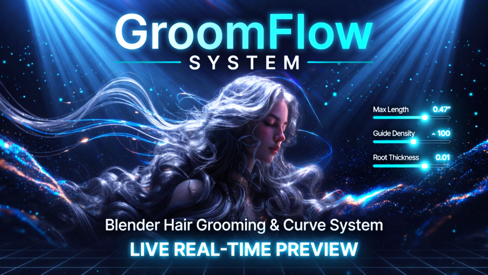

# GroomFlow_Pro Add-on Guidebook

Welcome to the official documentation and user guide page for GroomFlow_Pro. Learn how to maximize your workflow efficiency using this add-on.

## 🚀 Key Features

* **Real-time Graphic Optimization**: Enhance viewport performance with a single click.
* **Smart Guide System**: Provides an intuitive UI that even beginners can easily follow.
* **Powerful Presets**: Instantly apply a wide variety of pre-made templates.

## 🛠 Getting Started

If you are new to GroomFlow_Pro, follow these simple steps to get started:

1. **Download**: Get the latest version of the add-on file ready.
2. **Installation**: Install and activate the program according to the guide.
3. **Install Essential Extensions**: Go to the Extensions menu within the add-on preferences, and click 'Install' on the recommended base extensions to unlock full functionality.
4. **Preferences**: Adjust the options to fit your specific workspace layout.

---

## GroomFlow System - Comprehensive User Guide

GroomFlow 시스템 - 종합 사용자 가이드

Welcome to the official documentation for GroomFlow System. Follow this guide to unlock the full potential of real-time hair grooming in Blender.
GroomFlow 시스템의 공식 문서에 오신 것을 환영합니다. 블렌더에서 실시간 헤어 그루밍의 모든 잠재력을 잠금 해제하려면 이 가이드를 따르세요.

Core Mechanics: Weight-Based Live Guide Generation
핵심 메커니즘: 웨이트 기반 실시간 가이드 생성

The absolute core of GroomFlow System is generating and controlling hair curves based on Weight Paint Values with live, real-time feedback.
GroomFlow 시스템의 절대적인 핵심은 라이브 실시간 피드백을 통해 웨이트 페인트 값을 기반으로 헤어 커브를 생성하고 제어하는 것입니다.

### 1. Live Real-Time Control & Safety Lock
### 1. 라이브 실시간 제어 및 세이프티 락 (Lock)

You can tweak hair length, density, and thickness live while looking at your viewport. CRITICAL WARNING (Please Read!): If you edit or groom the generated hair curves manually and then tweak the sliders afterward, your edits will be COMPLETELY RESET. Always use the LOCK / UNLOCKED toggle button next to the Strand Shape Control to protect your custom grooms from resetting.
뷰포트를 보면서 헤어 길이, 밀도, 두께를 실시간으로 조절할 수 있습니다. 치명적인 경고 (필독!): 생성된 헤어 커브를 수동으로 편집하거나 빗질한 후 슬라이더를 조절하면 편집 내용이 완전히 초기화됩니다. 커스텀 그룸이 초기화되는 것을 방지하려면 항상 Strand Shape Control 옆에 있는 LOCK / UNLOCKED 토글 버튼을 사용하세요.

How to use:
조작법:

- Adjust sliders until you get the base shape. (기본 형태를 얻을 때까지 슬라이더를 조절합니다.)
- Click the LOCK button to freeze the parameters. (LOCK 버튼을 클릭하여 파라미터를 고정합니다.)
- Start custom manual grooming safely. (안전하게 커스텀 수동 그루밍을 시작합니다.)

[GIF PLACEHOLDER]
Path: assets/01_live_control_and_lock.gif
Description: Show sliding values and then locking the UI
설명: 슬라이더 값을 조절한 후 UI를 잠그는 모습 표시

Step-by-Step UI Function Guide
단계별 UI 기능 가이드

### 2. Hair Style Nodes Stack (Instant Styling)
### 2. 헤어 스타일 노드 스택 (즉각적인 스타일링)

We provide a highly intuitive node-stack layout to let you add fundamental hair structures instantly. Add Clump, Interpolate, Curl, Frizz, Braid, or Duplicate with a single click to build complex hair shapes without touching the geometry node editor.
기본적인 헤어 구조를 즉시 추가할 수 있도록 매우 직관적인 노드 스택 레이아웃을 제공합니다. 단 한 번의 클릭으로 Clump, Interpolate, Curl, Frizz, Braid 또는 Duplicate를 추가하여 지오메트리 노드 에디터를 만질 필요 없이 복잡한 헤어 형태를 빌드할 수 있습니다.

[GIF PLACEHOLDER]
Path: gifs/02_nodes_stack_styling.gif
Description: Clicking 'Add Clump' or 'Add Frizz' to instantly see hair change
설명: 'Add Clump' 또는 'Add Frizz'를 클릭하여 헤어가 즉시 변하는 모습 표시

### 3. Thickness & Noise (Defining Hair Strand Profile)
### 3. 두께 & 노이즈 (헤어 스트랜드 프로필 정의)

This panel allows fine-tuning of individual hair fiber aesthetics. Adjust Root Thickness and Tip Thickness to give strands a natural taper, and apply Frizz Noise Strength to introduce procedural strand imperfections for enhanced photorealism.
이 패널은 개별 헤어 섬유의 미적 디테일을 미세 조정할 수 있도록 해줍니다. Root Thickness(뿌리 두께)와 Tip Thickness(끝 정점 두께)를 조절하여 스트랜드가 끝으로 갈수록 자연스럽게 가늘어지게 만들고, Frizz Noise Strength(부스스한 노이즈 강도)를 적용하여 절차적인 불규칙함을 부여함으로써 극대화된 실사 플러그를 얻을 수 있습니다.

How to use:
조작법:

- Set Root Thickness for the base volume. (기본 볼륨을 위해 뿌리 두께를 설정합니다.)
- Taper the ends to 0.0000 using Tip Thickness. (끝 정점 두께를 사용하여 머리 끝을 0.0000으로 날카롭게 깎아줍니다.)
- Add micro frizz noise to break up CG neatness. (마이크로 노이즈를 추가하여 CG 특유의 인위적인 깔끔함을 깨뜨립니다.)

[GIF PLACEHOLDER]
Path: gifs/02_a_thickness_and_noise.gif
Description: Adjusting root and tip thickness live in viewport
설명: 뷰포트에서 실시간으로 뿌리와 끝 두께를 조절하는 모습 표시

### 4. Realtime Simple Children Management (Performance Boost)
### 4. 실시간 심플 칠드런 매니지먼트 (퍼포먼스 향상)

This panel drives the ultra-performance hair multiplication layer with C-accelerated NumPy computing. It features Unique Layer Auto-Tracking, which automatically syncs the UI parameters and live brush strokes to whichever hair object you click in the viewport. It also automatically injects a "Set Hair Curve Profile" node block upon execution to prevent the hair diameter from exploding in Cycles render mode.
이 패널은 C-가속 NumPy 연산을 통해 극대화된 퍼포먼스의 머리카락 숱 뻥튀기 레이어를 가동합니다. 뷰포트에서 클릭하는 머리카락 오브젝트에 따라 UI 파라미터와 라이브 브러시 스트로크가 자동으로 동기화되는 레이어 자동 추적 기능이 특징입니다. 또한 실행 즉시 "Set Hair Curve Profile" 노드 블록을 자동으로 주입하여 Cycles 렌더 모드에서 머리카락 지름이 폭발하는 현상을 방지합니다.

How to use:
조작법:

- Select your active hair curve object in the viewport. (뷰포트에서 활성화된 헤어 커브 오브젝트를 선택합니다.)
- Tweak Child Count, Radius, and Length Min/Max sliders live. (Child Count, Radius, Length Min/Max 슬라이더를 실시간으로 조절합니다.)
- Tweak the values dynamically—each layer saves its settings independently. (수치를 동적으로 조절하세요. 각 레이어는 설정을 독립적으로 저장합니다.)

[GIF PLACEHOLDER]
Path: gifs/02_b_realtime_children_slider.gif
Description: Showing unique layer auto-tracking and micro-radius control down to 0.0001
설명: 고유 레이어 자동 추적 및 0.0001까지 내려가는 마이크로 반경 제어 표시

### 5. Snap Settings (Fixing Floating Strands)
### 5. 스냅 세팅 (공중에 붕 뜬 스트랜드 고정)

When you use the Add Duplicate function to increase hair volume, the newly generated strands may float away or clipping through the scalp. The Snap Settings tool fixes this by forcefully snapping floating hair curves back down onto the target mesh surface perfectly.
헤어 볼륨을 늘리기 위해 Add Duplicate 기능을 사용할 때, 새로 생성된 스트랜드가 공중에 떠다니거나 두피를 뚫고 파묻힐 수 있습니다. 스냅 세팅 툴은 공중에 뜬 헤어 커브를 타겟 메쉬 표면 위로 완벽하게 강제 스냅하여 이 문제를 해결합니다.

How to use:
조작법:

- Select your scalp object in the picker and click Add Snap. (피커에서 두피 오브젝트를 선택하고 Add Snap을 클릭합니다.)

[GIF PLACEHOLDER]
Path: gifs/03_snap_floating_hair.gif
Description: Hair strands floating, then snapping perfectly to the head mesh
설명: 헤어 가닥들이 떠 있다가 머리 메쉬에 완벽하게 스냅되는 모습 표시

### 6. Smooth Weights Gradient (For Low-Poly Meshes)
### 6. 스무스 웨이트 그라디언트 (로우폴리 메쉬용)

Painting smooth weight transitions on low-poly head meshes can be extremely jagged due to the lack of vertices. The Smooth Weights Gradient button forces a soft, high-fidelity weight blur across low-density topology, allowing smooth hair distribution even on low-poly dummy heads.
정점이 부족한 로우폴리 머리 메쉬에 부드러운 웨이트 전환을 페인팅하는 것은 버텍스 부족으로 인해 매우 거칠고 계단 현상이 심할 수 있습니다. Smooth Weights Gradient 버튼은 밀도가 낮은 토폴로지 전반에 부드러운 고해상도 웨이트 블러를 강제 적용하여 로우폴리 더미 헤드에서도 부드러운 헤어 분배를 가능하게 합니다.

[GIF PLACEHOLDER]
Path: gifs/04_smooth_weights_gradient.gif
Description: Showing jagged vertex weights becoming a buttery smooth gradient
설명: 거친 정점 웨이트가 버터처럼 부드러운 그라디언트로 변하는 모습 표시

### 7. Replace Existing Hair vs Multi-Layer Stack
### 7. 기존 헤어 대체 vs 멀티 레이어 스택

The Replace Existing Hair checkbox dictates how new hair curves behave on the same vertex group.
Replace Existing Hair 체크박스는 동일한 버텍스 그룹에서 새로운 헤어 커브가 작동하는 방식을 결정합니다.

[Checked ON]: Use this when you want to wipe the slate clean and generate a brand-new set of hair curves from scratch.
[체크 활성화]: 기존 데이터를 깨끗이 지우고 완전히 처음부터 새로운 헤어 커브 세트를 생성하고 싶을 때 사용합니다.

[Unchecked OFF]: CRITICAL FOR MULTI-LAYERING. Turn this OFF if you want to create multiple overlapping hair curve layers on the same weight mask. This allows you to stack different styles freely on a single weight group for ultimate stylistic freedom.
[체크 해제]: 멀티 레이어링에 필수적입니다. 동일한 웨이트 마스크 위에 여러 개의 중첩된 헤어 커브 레이어를 만들고 싶다면 이 옵션을 끄세요. 이를 통해 단일 웨이트 그룹 위에 다양한 스타일을 자유롭게 쌓아 올려 극대화된 스타일의 자유도를 얻을 수 있습니다.

[GIF PLACEHOLDER]
Path: gifs/05_replace_on_vs_off.gif
Description: Generating hair with Replace ON vs adding separate layers with Replace OFF
설명: Replace ON 상태로 헤어를 생성하는 것과 Replace OFF 상태로 별도의 레이어를 추가하는 방식 대조 표시

[Added Bonus] Recommended Expert Workflow Tips
[추가 보너스] 추천 전문가 워크플로우 팁

The Multi-Layer Strategy: Don't try to make the whole hairstyle in one layer. Create a 'Base' layer (High density, short), a 'Main' layer (Medium density, styled), and a 'Flyaway' layer (Low density, high frizz) with Replace Existing Hair turned OFF.
멀티 레이어 전략: 전체 헤어스타일을 하나의 레이어로 만들려고 하지 마세요. Replace Existing Hair를 끈 상태에서 '베이스' 레이어 (높은 밀도, 짧은 길이), '메인' 레이어 (중간 밀도, 스타일링 적용), 그리고 '플라이어웨이' 레이어 (낮은 밀도, 높은 부스스함)를 생성하세요.

Performance Tip: Lower the Strand Resolution to 4 or 6 while working on massive hairstyles, then bump it up to 12 right before exporting to Unreal Engine for maximum viewport performance.
<<<<<<< HEAD
퍼포먼스 팁: 방대한 헤어스타일을 작업하는 동안에는 Strand Resolution을 4 또는 6으로 낮추어 최상의 뷰포트 성능을 유지하고, 언리얼 엔진으로 내보내기 직전에 12로 올려 최고의 뷰포트 퍼포먼스를 확보하세요.
=======
퍼포먼스 팁: 방대한 헤어스타일을 작업하는 동안에는 Strand Resolution을 4 또는 6으로 낮추어 최상의 뷰포트 성능을 유지하고, 언리얼 엔진으로 내보내기 직전에 12로 올려 최고의 뷰포트 퍼포먼스를 확보하세요.
>>>>>>> c357b3b72d12e2ed8b16d956de997c51ad189163
